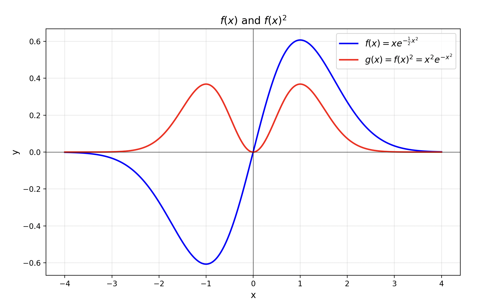
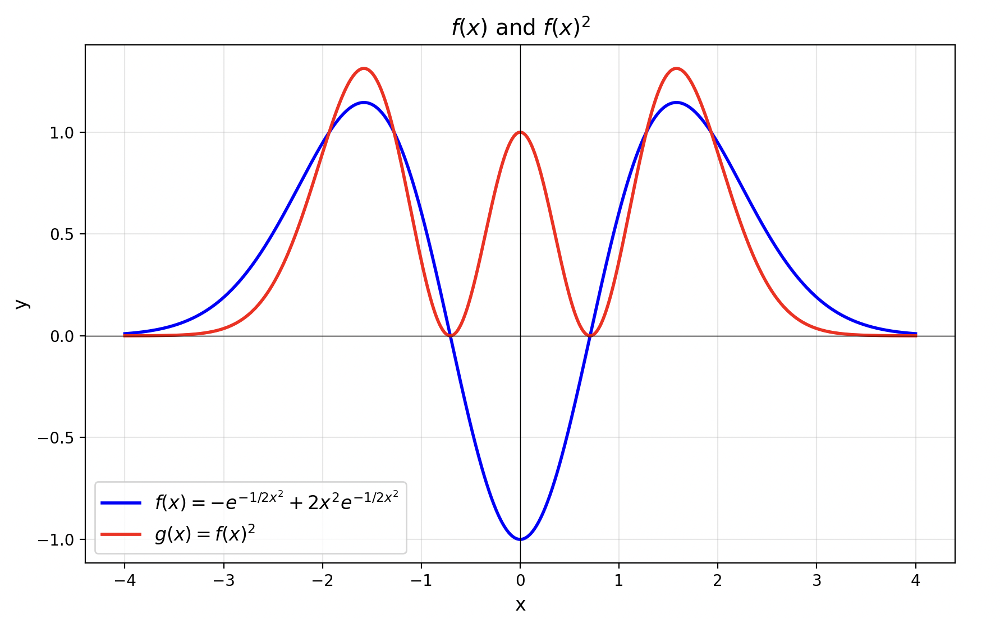

+++
date = '2025-10-22T18:00:00+08:00'
title = 'Spin'
tags = ['Advanced Quantum Mechanics']
categories = ["Physics"]
+++

For the one-dimensional harmonic oscillator problem, its Hamiltonian can be written as \(H = \frac{p^2}{2} + \frac{1}{2}\omega^2 x^2\). Our goal is to solve its energy eigenvalue equation \(H\varphi = E\varphi\). To solve it using a more concise algebraic method, we introduce a pair of ladder operators defined as:
\[
a^{\pm} = \frac{p \pm i\omega x}{\sqrt{2\omega}}
\]
Here \(a^+\) is usually called the creation operator \(a^\dagger\), and \(a^-\) is called the annihilation operator \(a\). With these operators, we can express the Hamiltonian in a more compact form. We define the number operator as \(N = a^\dagger a\). After some derivation, we find that the relation between the Hamiltonian and the number operator is:
\[
H = \omega \left(N + \frac{1}{2}\right)
\]
This form greatly simplifies the solution process.

---

Directly solving the Schrödinger equation of the harmonic oscillator is a second-order ordinary differential equation, and the procedure is rather tedious. Dirac invented a more profound algebraic method whose core idea is to try to “factorize” the Hamiltonian operator \(H\). In natural units (setting \(m=1, \hbar=1\)), the Hamiltonian \(H = \frac{p^2}{2m} + \frac{1}{2}m\omega^2 x^2\) is \(H = \frac{p^2}{2} + \frac{1}{2}\omega^2 x^2\), which looks very similar to the sum of squares \(A^2+B^2\). Although in quantum mechanics the position operator \(x\) and the momentum operator \(p\) do not commute (\([x, p] = i\)), and thus cannot be factorized like ordinary numbers, this idea inspires us to construct a pair of mutually Hermitian conjugate operators \(a\) and \(a^\dagger\), such that \(H\) can be expressed compactly in terms of their product \(a^\dagger a\). This pair of operators is precisely the raising and lowering operators we introduced earlier.

Let us compute the explicit form of \(a^\dagger a\), where \(a^\dagger = a^+\) and \(a = a^-\):
\[
\begin{aligned}
a^\dagger a &= \left( \frac{p + i\omega x}{\sqrt{2\omega}} \right) \left( \frac{p - i\omega x}{\sqrt{2\omega}} \right) \\
&= \frac{1}{2\omega} (p + i\omega x)(p - i\omega x) \\
&= \frac{1}{2\omega} (p^2 - i\omega px + i\omega xp + \omega^2 x^2) \\
&= \frac{1}{2\omega} (p^2 + \omega^2 x^2 - i\omega(px - xp))
\end{aligned}
\]
Using the commutation relation \([p, x] = -i\), i.e. \(px - xp = -i\), and substituting into the above expression, we obtain:
\[
\begin{aligned}
a^\dagger a &= \frac{1}{2\omega} (p^2 + \omega^2 x^2 - i\omega(-i)) \\
&= \frac{1}{2\omega} (p^2 + \omega^2 x^2 - \omega) \\
&= \frac{p^2 + \omega^2 x^2}{2\omega} - \frac{1}{2}
\end{aligned}
\]
Thus we obtain \(a^\dagger a = \frac{H}{\omega} - \frac{1}{2}\), and after rearranging we get the compact form of the Hamiltonian \(H = \omega (a^\dagger a + \frac{1}{2})\). If we define the number operator \(N = a^\dagger a\), then \(H = \omega(N + \frac{1}{2})\). This algebraic form is very powerful and can directly yield all the key physical results of the quantum harmonic oscillator.

First, the energy of the system is quantized. Since \(H\) and \(N\) differ only by a constant, they share the same eigenstates. If \(|n\rangle\) is an eigenstate of \(N\) with eigenvalue \(n\), i.e. \(N|n\rangle = n|n\rangle\), then acting with the Hamiltonian operator gives \(H|n\rangle = \omega(N+\frac{1}{2})|n\rangle = \omega(n+\frac{1}{2})|n\rangle\). This means that the system’s energy can only take a series of discrete values:
\[ E_n = \omega\left(n + \frac{1}{2}\right) \]
Second, the operators \(a^\dagger\) and \(a\) play the role of “rungs” on the energy ladder. To prove this, we first compute their commutation relations with the Hamiltonian. Using \([x, p] = i\), we can obtain \([a, a^\dagger] = 1\). From this we get:
\[ [H, a] = [\omega(a^\dagger a + 1/2), a] = \omega[a^\dagger a, a] = -\omega a \]
\[ [H, a^\dagger] = [\omega(a^\dagger a + 1/2), a^\dagger] = \omega[a^\dagger a, a^\dagger] = \omega a^\dagger \]
Now we act \(H\) on \(a|n\rangle\), where \(|n\rangle\) is an eigenstate with energy \(E_n\):
\[ H(a|n\rangle) = (aH + [H, a])|n\rangle = aE_n|n\rangle - \omega a|n\rangle = (E_n - \omega)(a|n\rangle) \]
This shows that \(a|n\rangle\) is a new energy eigenstate whose energy is exactly one quantum \(\omega\) less than that of \(E_n\). Therefore, when \(a\) acts on the state \(|n\rangle\), it produces a new state corresponding to \(n-1\), and hence it is called the annihilation operator. Similarly, we can prove the action of \(a^\dagger\):
\[ H(a^\dagger|n\rangle) = (a^\dagger H + [H, a^\dagger])|n\rangle = a^\dagger E_n|n\rangle + \omega a^\dagger|n\rangle = (E_n + \omega)(a^\dagger|n\rangle) \]
This shows that the energy of \(a^\dagger|n\rangle\) is \(E_n + \omega\), so \(a^\dagger\) is called the creation operator. They respectively decrease or increase the energy eigenvalue by one unit \(\omega\).

Moreover, since the system’s energy cannot decrease without bound (\(H\) is positive definite), there must exist a lowest-energy ground state, denoted by \(|0\rangle\). The annihilation operator acting on the ground state can no longer lower its energy, so we must have \(a|0\rangle = 0\). At this point, the eigenvalue of the number operator is \(n=0\), and the corresponding ground-state energy is \(E_0 = \omega(0 + \frac{1}{2}) = \frac{\omega}{2}\). This famous “zero-point energy” is a direct manifestation of quantum effects.

Finally, all excited states can be generated from the ground state via the creation operator. Starting from the ground state \(|0\rangle\) and repeatedly applying the creation operator \(a^\dagger\), we can obtain all excited states like climbing a ladder:
\[ |n\rangle = \frac{(a^\dagger)^n}{\sqrt{n!}} |0\rangle \]

The denominator \(\sqrt{n!}\) in the expression is a normalization constant. Its role is to ensure that the length of the state vector \(|n\rangle\) is 1, i.e. \(\langle n|n\rangle = 1\), which is a basic requirement of the probabilistic interpretation in quantum mechanics. If we start from the ground state \(|0\rangle\) (assumed normalized), each application of the creation operator \(a^\dagger\) changes the length of the state vector. For example, the inner product (squared norm) of the unnormalized \(a^\dagger|0\rangle\) state is \(\langle 0| a a^\dagger |0\rangle = \langle 0| (a^\dagger a + 1) |0\rangle = 1\). The inner product of the unnormalized \((a^\dagger)^2|0\rangle\) state is \(\langle 0| a^2 (a^\dagger)^2 |0\rangle = 2\). One can generalize that the squared norm of \((a^\dagger)^n|0\rangle\) is \(n!\). Therefore, to make the final \(|n\rangle\) state satisfy the normalization condition \(\langle n|n\rangle=1\), we need to divide it by \(\sqrt{n!}\).

This shows that all energy levels form an equally spaced spectrum with spacing \(\omega\). This picture is also the origin of the “particle” concept in quantum field theory: each action of \(a^\dagger\) is equivalent to “creating” a quantum of energy \(\omega\) in the field.

---

Let us explicitly compute the wavefunction of the ground state \(|0\rangle\). By definition, the annihilation operator acting on the ground state gives zero:
\[ a|0\rangle = 0 \]
In the coordinate representation, the annihilation operator can be written as \(a \propto p-i\omega x\), where \(p = -i \frac{d}{dx}\) is the momentum operator. Let the ground-state wavefunction be \(\psi_0(x)\), then the above equation becomes:
\[ \left(-i \frac{d}{dx} - i\omega x\right) \psi_0(x) = 0 \]
This can be simplified to:
\[ \left(\frac{d}{dx} + \omega x\right) \psi_0(x) = 0 \]
This is a first-order linear differential equation. Assume a solution of the form \(\psi_0(x) = e^{f(x)}\), and substituting into the above gives:
\[ \frac{df}{dx} + \omega x = 0 \]
Integrating, we obtain \(f(x) = -\frac{\omega}{2}x^2 + C\). Therefore, the ground-state wavefunction is:
\[ \psi_0(x) = N e^{-\frac{1}{2}\omega x^2} \]
where \(N\) is a normalization constant, which can be obtained from \(\int_{-\infty}^{\infty} |\psi_0(x)|^2 dx = 1\). In the following discussion, for simplicity, we will temporarily ignore this constant.

Substituting this wavefunction into the time-independent Schrödinger equation \(H\psi = E\psi\), and working in units where \(\omega=1\), we can solve for the ground-state energy \(E_0 = 1/2\).

Next, we compute the wavefunction of the first excited state \(|1\rangle\). It can be obtained by acting with a creation operator \(a^\dagger\) on the ground state. Suppose \(a^\dagger \propto -i \frac{d}{dx} + i\omega x\), and let \(\omega=1\), then:
\[ \psi_1(x) = a^\dagger \psi_0(x) \propto \left(-i \frac{d}{dx} + ix\right) e^{-\frac{1}{2}x^2} = 2x e^{-\frac{1}{2}x^2} \]
The figure below shows the graphs of the function \(f(x) = xe^{-\frac{1}{2}x^2}\) and its square. Here \(f(x)^2\) is proportional to the probability density of finding the particle at various positions in space in the first excited state. From the figure, we can see that the probability of the particle appearing at \(x=0\) is zero.

For the second excited state \(|2\rangle\), we can similarly obtain \(\psi_2(x) = a^\dagger \psi_1(x)\) by acting with the creation operator. Ignoring all coefficients, its form is roughly:
\[ \psi_2(x) \propto \left(-\frac{d}{dx}+x\right) \left(xe^{-\frac{1}{2}x^2}\right) \propto (1-2x^2)e^{-\frac{1}{2}x^2} \]
The graph of its wavefunction probability density is shown below:

The spatial distribution plots of these wavefunctions at different energy levels are reminiscent of the hydrogen atom electron orbitals learned in high school chemistry. However, the harmonic oscillator model and the hydrogen atom model are different. The electron in a hydrogen atom is subject to the Coulomb potential of the \(V(r) \propto 1/r\) produced by the nucleus, and its Hamiltonian has a different potential term from the \(V(x) \propto x^2\) of the harmonic oscillator, so the resulting eigenstates are different.

---

We know that the orbital angular momentum operators \(L_x, L_y, L_z\) in quantum mechanics satisfy fundamental commutation relations, for example \([L_z, L_x] = iL_y\) and its cyclic permutations. Interestingly, there exists a set of 2×2 matrices, the Pauli matrices, which possess a very similar algebraic structure. These three matrices are defined as:
\[
\sigma_z = \begin{pmatrix} 1 & 0 \\ 0 & -1 \end{pmatrix}, \quad
\sigma_x = \begin{pmatrix} 0 & 1 \\ 1 & 0 \end{pmatrix}, \quad
\sigma_y = \begin{pmatrix} 0 & -i \\ i & 0 \end{pmatrix}
\]
It is worth mentioning that all three Pauli matrices are Hermitian. By direct calculation, we can verify their commutation relations:
\[
[\sigma_z, \sigma_x] = 2i\sigma_y
\]
This relation is very similar to the commutation relations of angular momentum. To make the forms exactly correspond, we can define a new operator \( \vec{s} = \vec{\sigma}/2 \). In this way, its components satisfy:
\[
[s_z, s_x] = is_y
\]
This is completely identical in form to the commutation relations of orbital angular momentum. Therefore, we can regard \(\vec{s}\) as a kind of angular momentum, namely what we call spin angular momentum.

A natural next question is: what are the eigenvalues of the operator \(s_z\)? By computing the eigenvalues of \(\sigma_z/2\), we easily find that the result is \( \pm 1/2 \). This result perfectly matches the general properties of angular momentum eigenvalues. We know that angular momentum eigenvalues form a ladder-like distribution with step size 1. According to the different quantum numbers, there are two cases: one is orbital angular momentum \(L\), whose magnetic quantum number \(m_l\) is an integer \( (\dots, -2, -1, 0, 1, 2, \dots) \); the other is spin angular momentum \(S\), whose magnetic quantum number \(m_s\) is a half-integer \( (\dots, -1/2, 1/2, \dots) \). It should be emphasized that this important conclusion—that angular momentum eigenvalues form a ladder—is derived entirely from the commutation relations of its operators. These commutation relations themselves are the fundamental definition of angular momentum, so this property is independent of the specific form of the system’s Hamiltonian. Whether it is orbital angular momentum \(L\) or intrinsic spin angular momentum \(S\), both must satisfy this relation.

Finally, when a particle has both orbital motion and intrinsic spin, its total angular momentum \(J\) is the vector sum of the orbital angular momentum \(L\) and the spin angular momentum \(S\), denoted as \(J = L + S\).

---

In quantum mechanics, the eigenvalue equation of the angular momentum operator \(L^2\) can be written as \(L^2|\psi\rangle = \hbar^2 l(l+1)|\psi\rangle\), and for brevity we often omit \(\hbar\). For each eigenvalue \(l(l+1)\) of an angular momentum operator \(L^2\), there correspond \(2l+1\) degenerate eigenstates. This means that for \(l=0, 1, 2, \dots\) we have \(1, 3, 5, \dots\) quantum states. We can group all eigenstates according to the different values of the angular quantum number \(l\). To pinpoint a specific quantum state within the same group, we introduce the magnetic quantum number \(m_l\), whose range is \(-l, -l+1, \dots, l\), giving a total of \(2l+1\) values. In this way, a pair of quantum numbers \((l, m_l)\) uniquely specifies an angular momentum eigenstate.

Within the same \(l\) group, these \(2l+1\) quantum states not only have the same magnitude of angular momentum, but in the absence of external magnetic fields or other perturbations, they also have exactly the same energy. The fundamental reason behind this is that the Hamiltonian \(H\), which describes the system’s energy, possesses rotational symmetry in a central force field (such as the Coulomb force of the nucleus on the electron). This symmetry ensures that \(H\) commutes with the total angular momentum operator \(L^2\) and any of its components (such as \(L_z\)), i.e. \([H, L^2] = 0\) and \([H, L_z] = 0\). \([H, L^2] = 0\) means that energy eigenstates can simultaneously be eigenstates of the magnitude of angular momentum. The degeneracy of \(m_l\) is not deduced solely from \([H, L_z]=0\) (which only implies that \(H\) and \(L_z\) can share common eigenstates); what truly leads to the degeneracy of \(m_l\) is that \(H\) also commutes with \(L_x, L_y\) (i.e. full rotational symmetry), which allows us to use raising and lowering operators to “jump” between different \(m_l\) without changing the energy.

Now let us look at a very important and special system—the hydrogen atom. By solving its time-independent Schrödinger equation:
\[
H|\psi\rangle = E|\psi\rangle
\]
we can obtain all possible energy eigenvalues \(E\) of the system. For the hydrogen atom, the bound-state energy values are quantized:
\[
E_n = -\frac{13.6 \text{ eV}}{n^2}, \quad n=1, 2, 3, \dots
\]
The integer \(n\) here is called the principal quantum number. From the formula we see that the energy of the hydrogen atom depends only on the principal quantum number \(n\). This leads to a phenomenon known as “extra degeneracy” or “accidental degeneracy”: all quantum states corresponding to the same principal quantum number \(n\), regardless of their angular quantum number \(l\), have exactly the same energy. This goes beyond the \(2l+1\)-fold degeneracy determined solely by rotational symmetry that we mentioned earlier.

So, which quantum states correspond to a given principal quantum number \(n\)? In the process of solving the Schrödinger equation, we must satisfy an important mathematical constraint: the allowed values of the angular quantum number \(l\) depend on the principal quantum number \(n\). For a given \(n\), \(l\) can only take the values \(0, 1, 2, \dots, n-1\). The root of this rule lies in the fact that only when \(l < n\) does the radial equation describing the wavefunction’s radial behavior admit physically reasonable, non-divergent solutions. From physical intuition, one can think of the system’s total energy (determined by \(n\)) as finite, and it must be distributed between radial motion and angular motion (determined by \(l\)). If the angular momentum \(l\) is too large, the energy required to sustain its motion would exceed the total energy budget of that level, and thus is not allowed. Therefore, we have the following correspondences:
* When \(n=1\), \(l\) can only be \(0\).
* When \(n=2\), \(l\) can be \(0\) and \(1\).
* When \(n=3\), \(l\) can be \(0\), \(1\), and \(2\).
And so on.

---

This leads to the famous Pauli exclusion principle. The principle states: in a system composed of fermions (i.e. particles with half-integer spin, such as electrons and protons), no two or more particles can occupy exactly the same quantum state.

For electrons in an atom, this means that no two electrons can have an identical set of quantum numbers \((n, l, m_l, m_s)\).

Electrons are fermions with spin \(s=1/2\), so for each spatial orbital specified by \((n, l, m_l)\), the spin projection \(m_s\) can take two values, \(1/2\) or \(-1/2\). Therefore, according to the Pauli exclusion principle, each spatial orbital can accommodate at most two electrons (one with spin up and one with spin down).

Combining the previous discussion of the quantum numbers \(n\) and \(l\), we can calculate the maximum number of electrons each electron shell can hold:

* When \(n=1\) (K shell): \(l\) can only be 0. This corresponds to 1 orbital (\(m_l=0\)), which can hold \(1 \times 2 = 2\) electrons.
* When \(n=2\) (L shell): \(l\) can be 0 and 1.
    * \(l=0\) (s orbital) has 1 orbital.
    * \(l=1\) (p orbital) has 3 orbitals (\(m_l = -1, 0, 1\)).
    * In total there are 4 orbitals, which can hold \(4 \times 2 = 8\) electrons.
* When \(n=3\) (M shell): \(l\) can be 0, 1, 2.
    * \(l=0\) (s) has 1 orbital, \(l=1\) (p) has 3 orbitals, and \(l=2\) (d) has 5 orbitals.
    * In total there are \(1+3+5=9\) orbitals, which can hold \(9 \times 2 = 18\) electrons.

It is worth noting that electron spin is not just an abstract mathematical label; it has real physical effects. Because the electron carries charge and has spin, it behaves like a tiny magnet (magnetic dipole). If we place an electron in an external magnetic field \(\vec{B}\), its energy will change; this is called the Zeeman effect.

The interaction potential energy between the electron and the magnetic field is \(U = -\vec{\mu} \cdot \vec{B}\), where \(\vec{\mu}\) is the magnetic moment of the electron, which is proportional to its spin \(\vec{S}\). Since the projection of the spin along the direction of the magnetic field \(S_z\) is quantized (it can only take \(\pm \hbar/2\)), the electron’s energy can also take only two specific values:
* Spin up: magnetic moment parallel to the magnetic field, energy decreases.
* Spin down: magnetic moment antiparallel to the magnetic field, energy increases.
