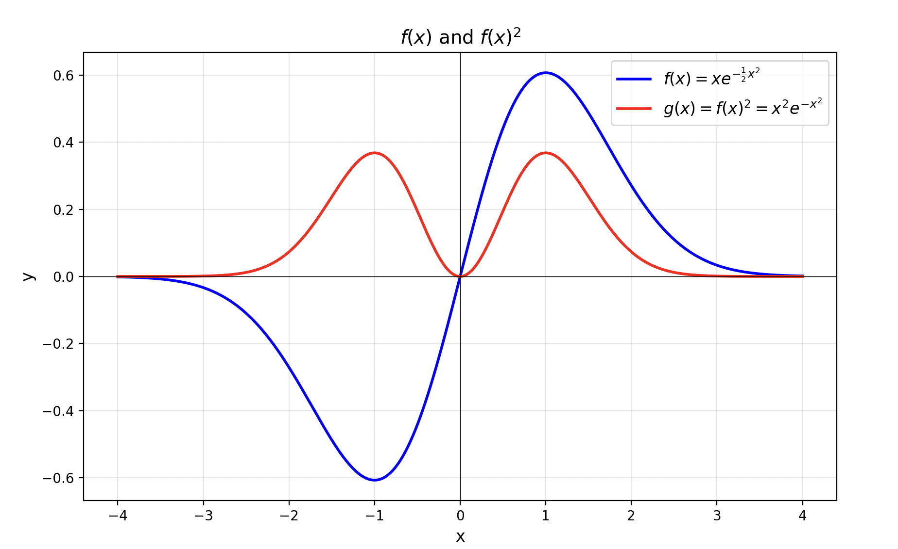
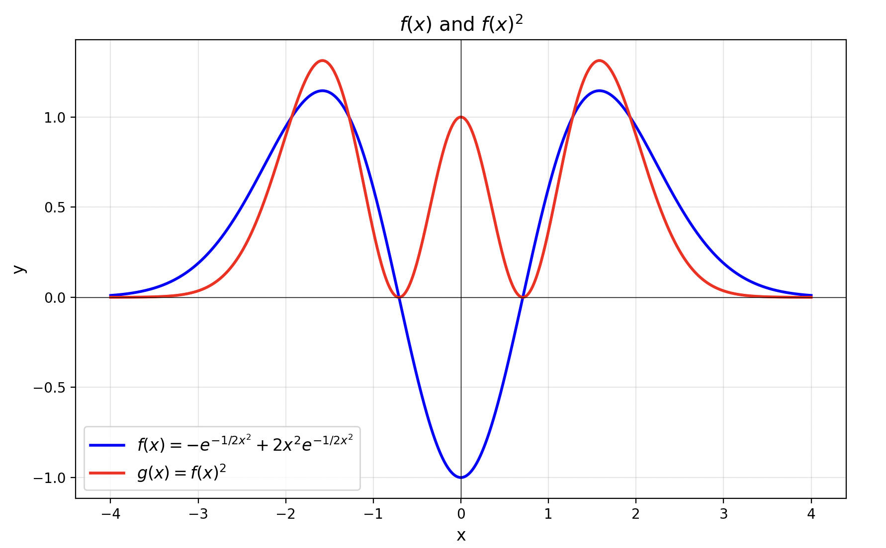

+++
date = '2025-10-22T18:00:00+08:00'
title = '自旋'
tags = ['Advanced Quantum Mechanics']
categories = ["Physics"]
+++

对于一维谐振子问题，其哈密顿量可以表示为 \(H = \frac{p^2}{2} + \frac{1}{2}\omega^2 x^2\)。我们的目标是求解其能量本征方程 \(H\varphi = E\varphi\)。为了用一种更简洁的代数方法求解，我们引入一对阶梯算符，定义为：
\[
a^{\pm} = \frac{p \pm i\omega x}{\sqrt{2\omega}}
\]
其中 \(a^+\) 通常被称为创生算符 \(a^\dagger\)，而 \(a^-\) 被称为湮灭算符 \(a\)。通过这些算符，我们可以将哈密顿量表达成一个更简洁的形式。我们定义粒子数算符为 \(N = a^\dagger a\)。经过推导可以发现，哈密顿量与粒子数算符的关系为：
\[
H = \omega \left(N + \frac{1}{2}\right)
\]
这个形式极大地简化了问题的求解过程。

---

直接求解谐振子的薛定谔方程是一个二阶常微分方程，过程较为繁琐。狄拉克发明了一种更深刻的代数方法，其核心思想是尝试对哈密顿算符 \(H\) 进行“因式分解”。哈密顿量 \(H = \frac{p^2}{2m} + \frac{1}{2}m\omega^2 x^2\) 在自然单位制（令 \(m=1, \hbar=1\)）下为 \(H = \frac{p^2}{2} + \frac{1}{2}\omega^2 x^2\)，这个形式很像平方和 \(A^2+B^2\)。虽然在量子力学中位置算符 \(x\) 和动量算符 \(p\) 不对易（\([x, p] = i\)），不能像普通数字一样直接分解，但这个思路启发我们去构造一对互为厄米共轭的算符 \(a\) 和 \(a^\dagger\)，使得 \(H\) 能用它们的乘积 \(a^\dagger a\) 来简洁地表达。这对算符就是我们之前引入的升降算符。

我们来计算一下 \(a^\dagger a\) 的具体形式，其中 \(a^\dagger = a^+\) 而 \(a = a^-\)：
\[
\begin{aligned}
a^\dagger a &= \left( \frac{p + i\omega x}{\sqrt{2\omega}} \right) \left( \frac{p - i\omega x}{\sqrt{2\omega}} \right) \\
&= \frac{1}{2\omega} (p + i\omega x)(p - i\omega x) \\
&= \frac{1}{2\omega} (p^2 - i\omega px + i\omega xp + \omega^2 x^2) \\
&= \frac{1}{2\omega} (p^2 + \omega^2 x^2 - i\omega(px - xp))
\end{aligned}
\]
利用对易关系 \([p, x] = -i\)，即 \(px - xp = -i\)，代入上式得到：
\[
\begin{aligned}
a^\dagger a &= \frac{1}{2\omega} (p^2 + \omega^2 x^2 - i\omega(-i)) \\
&= \frac{1}{2\omega} (p^2 + \omega^2 x^2 - \omega) \\
&= \frac{p^2 + \omega^2 x^2}{2\omega} - \frac{1}{2}
\end{aligned}
\]
由此我们得到 \(a^\dagger a = \frac{H}{\omega} - \frac{1}{2}\)，整理后便获得了哈密顿量的简洁形式 \(H = \omega (a^\dagger a + \frac{1}{2})\)。若定义粒子数算符 \(N = a^\dagger a\)，则 \(H = \omega(N + \frac{1}{2})\)。这个代数形式非常强大，可以直接导出量子谐振子的所有核心物理结论。

首先，体系的能量是量子化的。由于 \(H\) 和 \(N\) 仅相差常数，它们拥有共同的本征态。若 \(|n\rangle\) 是 \(N\) 的一个本征态，其本征值为 \(n\)，即 \(N|n\rangle = n|n\rangle\)，那么作用哈密顿算符会得到 \(H|n\rangle = \omega(N+\frac{1}{2})|n\rangle = \omega(n+\frac{1}{2})|n\rangle\)。这意味着体系的能量只能取一系列离散值：
\[ E_n = \omega\left(n + \frac{1}{2}\right) \]
其次，算符 \(a^\dagger\) 和 \(a\) 扮演了能量阶梯的“梯子”角色。为了证明这一点，我们首先计算它们与哈密顿量的对易关系。利用 \([x, p] = i\)，我们可以得到 \([a, a^\dagger] = 1\)。由此可得：
\[ [H, a] = [\omega(a^\dagger a + 1/2), a] = \omega[a^\dagger a, a] = -\omega a \]
\[ [H, a^\dagger] = [\omega(a^\dagger a + 1/2), a^\dagger] = \omega[a^\dagger a, a^\dagger] = \omega a^\dagger \]
现在，我们将 \(H\) 作用在 \(a|n\rangle\) 上，其中 \(|n\rangle\) 是能量为 \(E_n\) 的本征态：
\[ H(a|n\rangle) = (aH + [H, a])|n\rangle = aE_n|n\rangle - \omega a|n\rangle = (E_n - \omega)(a|n\rangle) \]
这表明 \(a|n\rangle\) 是一个新的能量本征态，其能量比 \(E_n\) 恰好少了一个量子 \(\omega\)。因此，\(a\) 作用在态 \(|n\rangle\) 上会得到一个对应于 \(n-1\) 的新状态，故被称为湮灭算符。同理，我们可以证明 \(a^\dagger\) 的作用：
\[ H(a^\dagger|n\rangle) = (a^\dagger H + [H, a^\dagger])|n\rangle = a^\dagger E_n|n\rangle + \omega a^\dagger|n\rangle = (E_n + \omega)(a^\dagger|n\rangle) \]
这表明 \(a^\dagger|n\rangle\) 的能量为 \(E_n + \omega\)，所以 \(a^\dagger\) 被称为创生算符。它们分别使能量本征值减小或增加一个单位 \(\omega\)。

另外，由于体系能量不能无限降低（\(H\) 是正定的），必须存在一个能量最低的基态，记为 \(|0\rangle\)。湮灭算符作用于基态不能再降低其能量，因此必然有 \(a|0\rangle = 0\)。此时，粒子数算符的本征值为 \(n=0\)，对应的基态能量为 \(E_0 = \omega(0 + \frac{1}{2}) = \frac{\omega}{2}\)。这个著名的“零点能”是量子效应的直接体现。

最后，所有激发态都可以由基态通过创生算符生成。从基态 \(|0\rangle\) 出发，不断使用创生算符 \(a^\dagger\)，就可以像爬梯子一样得到所有的激发态：
\[ |n\rangle = \frac{(a^\dagger)^n}{\sqrt{n!}} |0\rangle \]

表达式中的分母 \(\sqrt{n!}\) 是归一化常数。它的作用是确保态矢量 \(|n\rangle\) 的长度为1，即 \(\langle n|n\rangle = 1\)，这是量子力学中概率诠释的基本要求。如果我们从基态 \(|0\rangle\) （假设已归一化）出发，每次应用创生算符 \(a^\dagger\) 都会改变态矢量的长度。例如，未归一化的 \(a^\dagger|0\rangle\) 态的内积（模方）为 \(\langle 0| a a^\dagger |0\rangle = \langle 0| (a^\dagger a + 1) |0\rangle = 1\)。而未归一化的 \((a^\dagger)^2|0\rangle\) 态的内积是 \(\langle 0| a^2 (a^\dagger)^2 |0\rangle = 2\)。可以归纳出，\((a^\dagger)^n|0\rangle\) 的模方是 \(n!\)。因此，为了使最终的 \(|n\rangle\) 态满足归一化条件 \(\langle n|n\rangle=1\)，我们需要将其除以 \(\sqrt{n!}\)。

这表明所有能态构成了一个以 \(\omega\) 为间隔的等距能谱。这个图像也是量子场论中“粒子”概念的来源，每一次 \(a^\dagger\) 的作用，都相当于在场中“创生”了一个能量为 \(\omega\) 的量子。

---

我们来具体算一下基态 \(|0\rangle\) 的波函数。根据定义，湮灭算符作用于基态为零：
\[ a|0\rangle = 0 \]
在坐标表象下，湮灭算符可以写作 \(a \propto p-i\omega x\)，其中 \(p = -i \frac{d}{dx}\) 是动量算符。令基态波函数为 \(\psi_0(x)\)，则上述方程变为：
\[ \left(-i \frac{d}{dx} - i\omega x\right) \psi_0(x) = 0 \]
这可以简化为：
\[ \left(\frac{d}{dx} + \omega x\right) \psi_0(x) = 0 \]
这是一个一阶线性微分方程。设解的形式为 \(\psi_0(x) = e^{f(x)}\)，代入上式可得：
\[ \frac{df}{dx} + \omega x = 0 \]
积分后得到 \(f(x) = -\frac{\omega}{2}x^2 + C\)。因此，基态的波函数为：
\[ \psi_0(x) = N e^{-\frac{1}{2}\omega x^2} \]
其中 \(N\) 是归一化常数，可以通过 \(\int_{-\infty}^{\infty} |\psi_0(x)|^2 dx = 1\) 计算得出。在后续的讨论中，为了简化，我们暂时忽略这个常数。

将此波函数代入定态薛定谔方程 \(H\psi = E\psi\)，在设 \(\omega=1\) 的单位制下，可以解得基态能量为 \(E_0 = 1/2\)。

接下来我们计算第一激发态 \(|1\rangle\) 的波函数。它可以通过在基态上作用一个产生算符 \(a^\dagger\) 得到。假设 \(a^\dagger \propto -i \frac{d}{dx} + i\omega x\)，并设 \(\omega=1\)，则有：
\[ \psi_1(x) = a^\dagger \psi_0(x) \propto \left(-i \frac{d}{dx} + ix\right) e^{-\frac{1}{2}x^2} = 2x e^{-\frac{1}{2}x^2} \]
下图展示了函数 \(f(x) = xe^{-\frac{1}{2}x^2}\) 及其平方的图像。其中 \(f(x)^2\) 正比于粒子在第一激发态时在空间中各个位置出现的概率密度。从图中可以看出，粒子在 \(x=0\) 处出现的概率为零。

对于第二激发态 \(|2\rangle\)，我们同样可以通过作用产生算符得到 \(\psi_2(x) = a^\dagger \psi_1(x)\)。忽略所有系数，其形式大致如下：
\[ \psi_2(x) \propto \left(-\frac{d}{dx}+x\right) \left(xe^{-\frac{1}{2}x^2}\right) \propto (1-2x^2)e^{-\frac{1}{2}x^2} \]
其波函数概率密度的图像如下所示：

上面这些不同能级的波函数在空间中的分布图像，让人联想到高中化学课上学到的氢原子电子轨道。然而，谐振子模型与氢原子模型是不同的。氢原子中的电子受到的是原子核产生的 \(V(r) \propto 1/r\) 的库仑势，其哈密顿量与谐振子的 \(V(x) \propto x^2\) 势能项不同，因此会解出不同的本征态。

---

我们知道，量子力学中的轨道角动量算符 \(L_x, L_y, L_z\) 之间满足基本的对易关系, 例如 \([L_z, L_x] = iL_y\) 及其循环置换。有趣的是，存在一组 2x2 矩阵，即泡利矩阵（Pauli matrices），它们也具有非常相似的代数结构。这三个矩阵定义如下：
\[
\sigma_z = \begin{pmatrix} 1 & 0 \\ 0 & -1 \end{pmatrix}, \quad
\sigma_x = \begin{pmatrix} 0 & 1 \\ 1 & 0 \end{pmatrix}, \quad
\sigma_y = \begin{pmatrix} 0 & -i \\ i & 0 \end{pmatrix}
\]
值得一提的是，这三个泡利矩阵都是厄米矩阵（Hermitian）。通过直接计算，我们可以验证它们之间的对易关系：
\[
[\sigma_z, \sigma_x] = 2i\sigma_y
\]
这个关系与角动量的对易关系非常相似。为了让形式完全对应，我们可以定义一个新的算符 \( \vec{s} = \vec{\sigma}/2 \)。如此一来，其分量便满足：
\[
[s_z, s_x] = is_y
\]
这与轨道角动量的对易关系形式完全一致。因此，我们可以将 \(\vec{s}\) 视为一种角动量，它就是我们所说的自旋角动量。

接下来一个自然的问题是，算符 \(s_z\) 的本征值是什么？通过计算 \(\sigma_z/2\) 的本征值，我们很容易得到其结果为 \( \pm 1/2 \)。这个结果完美地符合了角动量本征值的普遍性质。我们知道，角动量的本征值呈现阶梯状分布，其阶梯步长为1。根据其量子数的不同，分为两种情况：一种是轨道角动量 \(L\)，其磁量子数 \(m_l\) 为整数 \( (\dots, -2, -1, 0, 1, 2, \dots) \)，另一种就是自旋角动量 \(S\)，其磁量子数 \(m_s\) 为半整数 \( (\dots, -1/2, 1/2, \dots) \)。需要强调的是，角动量本征值成阶梯状这一重要结论，是完全由其算符的对易关系推导出来的，这个对易关系本身就是角动量的根本定义，因此该性质与具体系统的哈密顿量形式无关。无论是轨道角动量 \(L\) 还是内禀的自旋角动量 \(S\)，都必须满足这个关系。

最后，当一个粒子既有轨道运动，又具有内禀自旋时，它的总角动量 \(J\) 就是轨道角动量 \(L\) 和自旋角动量 \(S\) 的矢量和，记为 \(J = L + S\)。

---

在量子力学中，角动量算符 \(L^2\) 的本征方程可以写作 \(L^2|\psi\rangle = \hbar^2 l(l+1)|\psi\rangle\)，为了简洁我们常常省略 \(\hbar\)。对于每一个角动量算符 \(L^2\) 的本征值 \(l(l+1)\)，都对应着 \(2l+1\) 个简并的本征态。这意味着对于 \(l=0, 1, 2, \dots\)，我们分别有 \(1, 3, 5, \dots\) 个量子态。我们可以根据角量子数 \(l\) 的不同，将所有的本征态进行分组。为了在同一个分组内精确地定位到某一个具体的量子态，我们引入了磁量子数 \(m_l\)，它的取值范围为 \(-l, -l+1, \dots, l\)，共 \(2l+1\) 个值。这样，一对量子数 \((l, m_l)\) 就可以唯一地确定一个角动量本征态。

在同一个 \(l\) 分组内的这 \(2l+1\) 个量子态，它们不仅拥有相同的角动量大小，在不受外磁场等因素干扰的情况下，它们还拥有完全相同的能量。这背后的根本原因是描述系统能量的哈密顿算符 \(H\) 在中心力场（如原子核对电子的库仑力）中具有旋转对称性。这种对称性保证了 \(H\) 与总角动量算符 \(L^2\) 及其任意分量（如 \(L_z\)）都是可交换的（commute），即 \([H, L^2] = 0\) 和 \([H, L_z] = 0\)。\([H, L^2] = 0\) 意味着能量本征态可以同时是角动量大小的本征态；而 \([H, L_z] = 0\) 则保证了能量本征值与描述轨道方向的磁量子数 \(m_l\) 无关，从而导致了这 \(2l+1\) 重的能量简并。

现在，我们来看一个非常重要且特殊的系统——氢原子。通过求解其定态薛定谔方程：
\[
H|\psi\rangle = E|\psi\rangle
\]
我们可以得到系统所有可能的能量本征值 \(E\)，对于氢原子，其束缚态的能量值是量子化的：
\[
E_n = -\frac{13.6 \text{ eV}}{n^2}, \quad n=1, 2, 3, \dots
\]
这里的整数 \(n\) 被称为主量子数。从公式中可以看到，氢原子的能量只由主量子数 \(n\) 决定。这导致了一个被称为“额外简并”或“偶然简并”的现象：所有对应于同一个主量子数 \(n\) 的量子态，无论它们的角量子数 \(l\) 是多少，都拥有完全相同的能量。这超越了我们前面提到的仅由旋转对称性决定的 \(2l+1\) 重简并。

那么，一个给定的主量子数 \(n\) 究竟对应了哪些量子态呢？在求解薛定谔方程的过程中，数学上要求我们必须满足一个重要的约束条件，即角量子数 \(l\) 的取值依赖于主量子数 \(n\)。对于一个给定的 \(n\)，\(l\) 只能取 \(0, 1, 2, \dots, n-1\) 这些值。这个规则的根源在于，只有当 \(l < n\) 时，描述波函数径向行为的方程才有物理上合理的、非发散的解。从物理直觉上理解，可以认为系统的总能量（由 \(n\) 决定）是有限的，它必须分配给径向运动和角向运动（由 \(l\) 决定）。如果角动量 \(l\) 过大，维持其运动所需的能量就会超出该能级的总能量预算，因此这是不被允许的。所以，我们有如下对应关系：
*   当 \(n=1\)，\(l\) 只能为 \(0\)。
*   当 \(n=2\)，\(l\) 可以为 \(0\) 和 \(1\)。
*   当 \(n=3\)，\(l\) 可以为 \(0\)，\(1\) 和 \(2\)。
以此类推。

