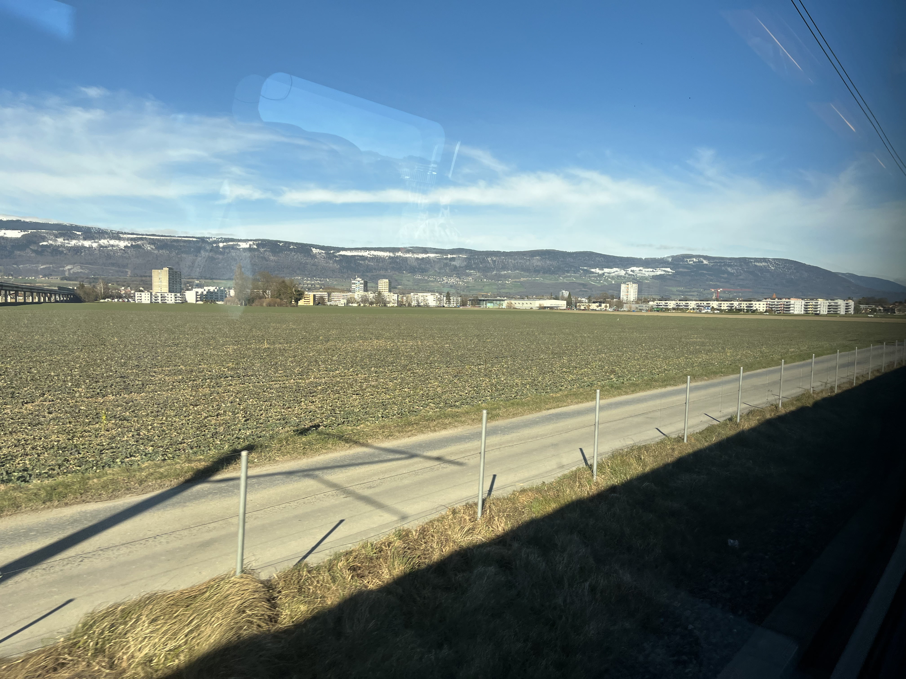
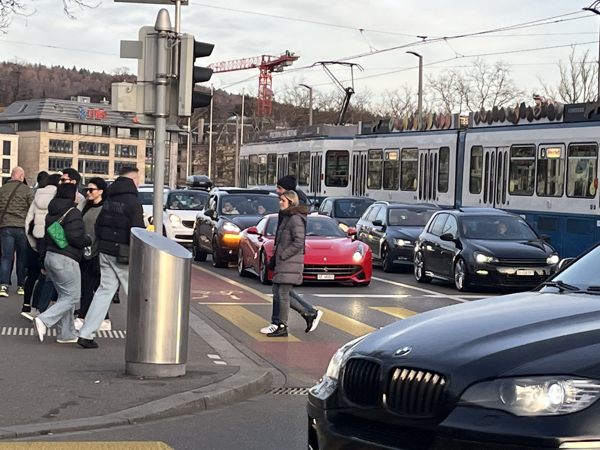
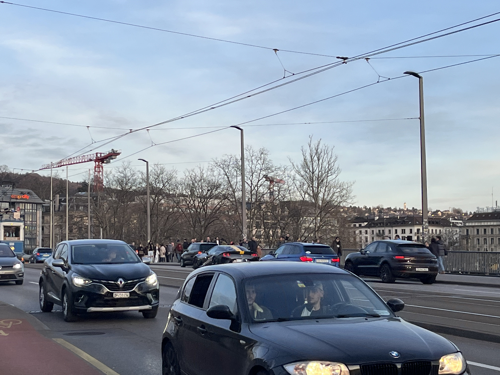
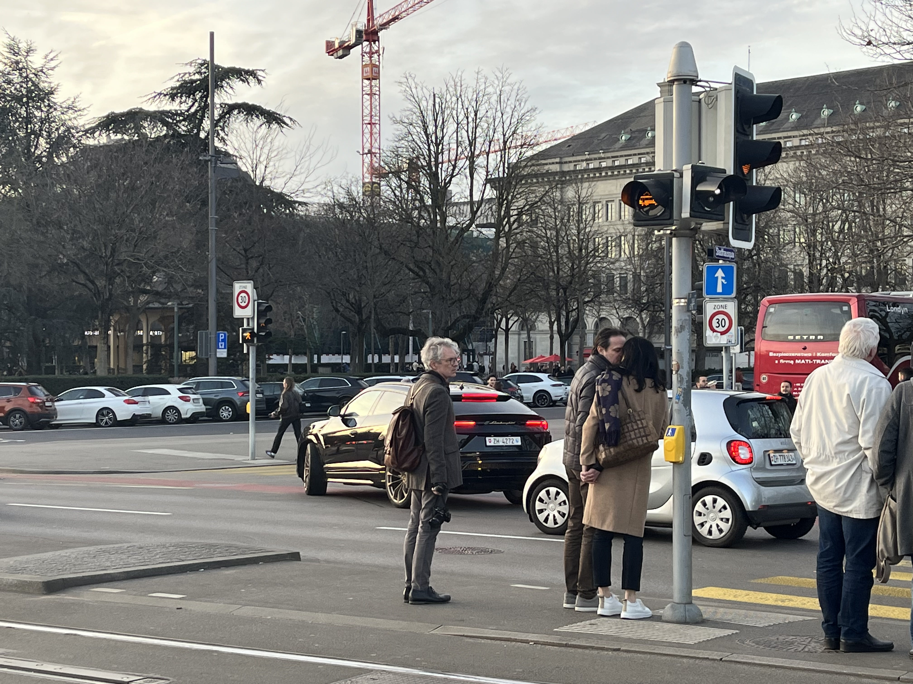
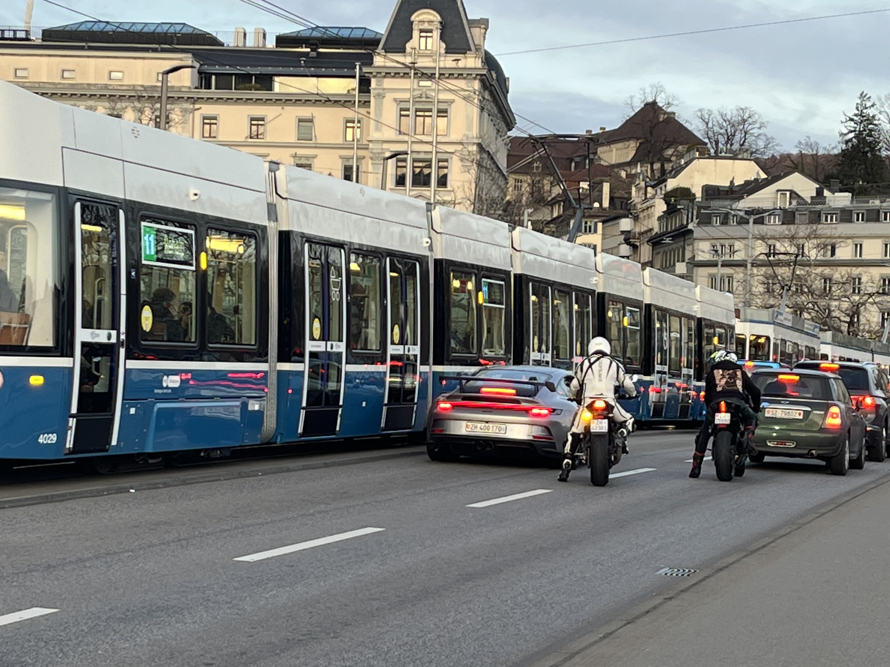
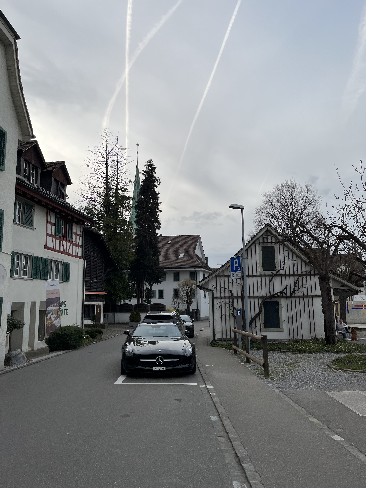
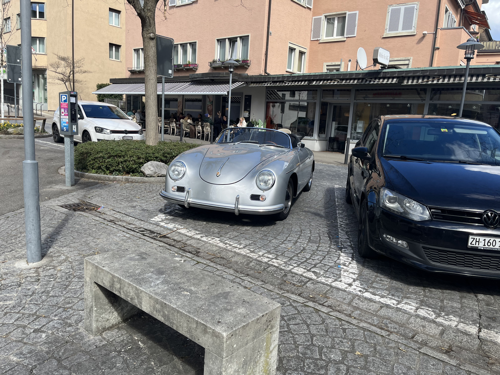
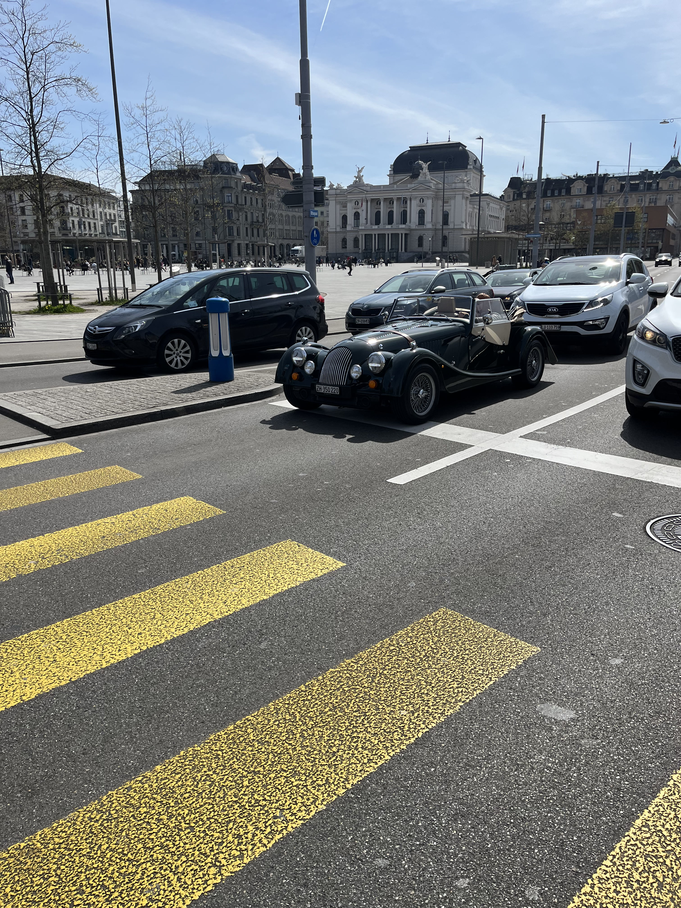
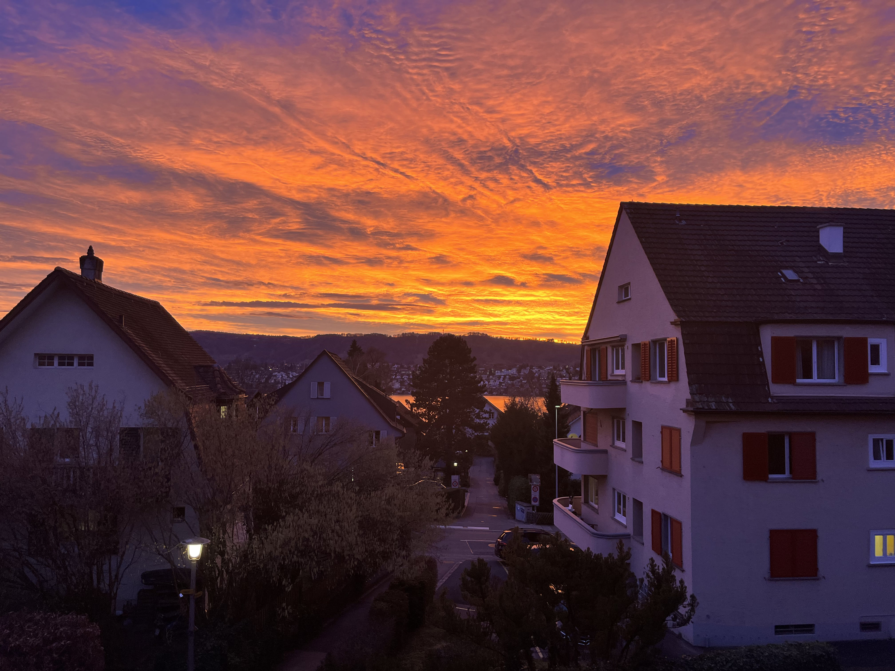
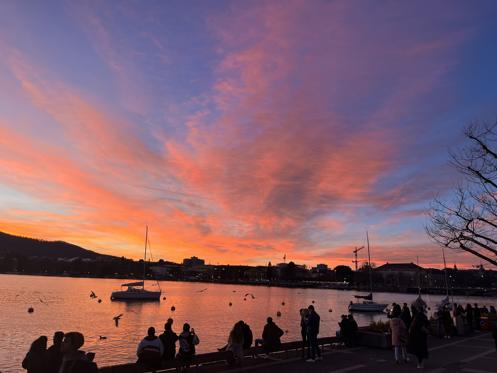

+++
date = '2026-09-15T23:17:00-04:00'
title = '苏黎世-一'
tags = ['Switzerland']
categories = ["Travel"]
+++

我开始回忆过去的旅行过的地方。我在2023年去了苏黎世，这几乎是我第一次离开中国（除了小时候去过一次日本）。我在苏黎世住了半年，这是我大三下学期的交换学期。

选苏黎世交换的原因之一其实就是去欧洲玩。去一趟欧洲对于中国国籍的人来说并不容易，旅游签证要早早的开始办，准备很多材料，然后花大价钱过去一趟流水线的游览那几个西欧国家，特别是瑞士这种花钱如流水的地方，酒店，餐饮等等。而事后看来，真的在欧洲租房，住下来几个月，慢慢的去不同国家旅行确实是欧洲的正确打开方式，事实上这样价格便宜，且欧洲总是对年轻人很友好（相比于北美和亚洲），有各种折价票学生票。

我对瑞士的印象是从贵开始的，事实上贵到让我感到悲伤。我在瑞士作为学生没有收入也不能工作。我记得买了一张sbb半价卡花了120法郎，从日内瓦机场坐到苏黎世的车上，火车车厢随着地形左摇右晃，伴随着对120法郎的不可置信，我在车上和当时在英国交换的男朋友打电话，记得最清楚的感觉就是悲伤。

苏黎世的豪车很多，应该是我目前去过的地方见过豪车、超跑最多的地方，保时捷作为普通用车非常之多，可能是德语区吧。也有各种老爷车，那些白人老钱以开着自己的老爷车上路作为一种炫富方式。

在苏黎世的第一天，我在房间里拍下来晚霞的照片，而那也是我在苏黎世接下来的半年里见过最漂亮的晚霞，再也没有见过了。

